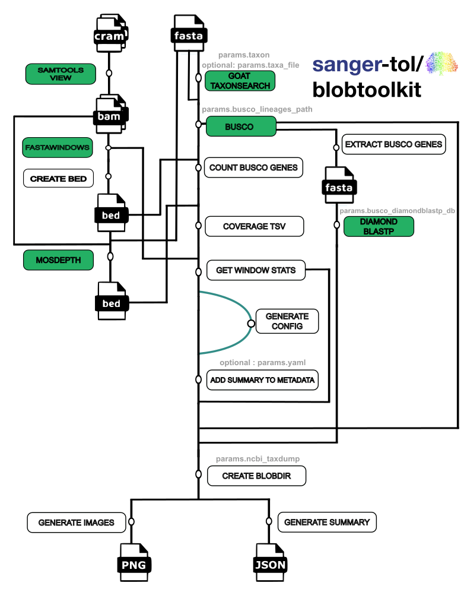

#  

[](https://github.com/sanger-tol/blobtoolkit/actions?query=workflow%3A%22nf-core+CI%22)
[](https://github.com/sanger-tol/blobtoolkit/actions?query=workflow%3A%22nf-core+linting%22)
[](https://doi.org/10.5281/zenodo.XXXXXXX)

[](https://www.nextflow.io/)
[](https://docs.conda.io/en/latest/)
[](https://www.docker.com/)
[](https://sylabs.io/docs/)
[](https://tower.nf/launch?pipeline=https://github.com/sanger-tol/blobtoolkit)

[](https://sangertreeoflife.slack.com/archives/pipelines)
[](https://twitter.com/sangertol)
[](https://www.youtube.com/channel/UCFeDpvjU58SA9V0ycRXejhA)

## Introduction

**sanger-tol/blobtoolkit** is a bioinformatics best-practice analysis pipeline written in Nextflow DSL2 for processing assembly, read and analysis files.

The pipeline is built using [Nextflow](https://www.nextflow.io), a workflow tool to run tasks across multiple compute infrastructures in a very portable manner. It uses Docker/Singularity containers making installation trivial and results highly reproducible. The [Nextflow DSL2](https://www.nextflow.io/docs/latest/dsl2.html) implementation of this pipeline uses one container per process which makes it much easier to maintain and update software dependencies. Where possible, these processes have been submitted to and installed from [nf-core/modules](https://github.com/nf-core/modules) in order to make them available to all nf-core pipelines, and to everyone within the Nextflow community!

On release, tests run the pipeline on a dataset on the Wellcome Sanger Institute HPC farm with Sigularity containers. This ensures that the pipeline runs, has sensible resource allocation defaults set to run on real-world datasets, and permits the persistent storage of results to benchmark between pipeline releases and other analysis sources.

## Pipeline summary

# 

Subworkflow: Input check

1.  Creates Samplesheet if TolID and Project provided
2.  Uncompress Fasta file if required
3.  Checks Samplesheet

Subworkflow: Coverage Stats

1.  Covert CRAM file to BAM ([`samools view`](https://www.htslib.org/doc/samtools-view.html))
2.  Generate statistics of interest in windows from fasta file ([`fastawindows`](https://github.com/tolkit/fasta_windows))
3.  Create BED file
4.  Calcuate Coverage ([`mosdepth`](https://github.com/brentp/mosdepth))

Subworkflow: Busco Diamond

1. Fetch BUSCO lineages for taxon ([`goat/taxonsearch`](https://github.com/genomehubs/goat-cli))
2. Run BUSCO search ([`busco`](https://busco.ezlab.org/))
3. Extract BUSCO genes
4. Run diamond_blastp with extracted busco genes ([`diamond/blastp`](https://github.com/bbuchfink/diamond))

Subworkflow: Collate Stats

1. Count BUSCO genes
2. Combine output of mosdepth and count_busco_genes
3. Aggregate 1kb values into windows of fixed proportion (10%, 1% of contig length) and fixed length (100kb, 1Mb)

Subworkflow: Blobtools

1. Generate config file from GCA accession code.
2. Imports analysis results into a BlobDir dataset.

## Quick Start

1. Install [`Nextflow`](https://www.nextflow.io/docs/latest/getstarted.html#installation) (`>=21.10.3`)

2. Install any of [`Docker`](https://docs.docker.com/engine/installation/), [`Singularity`](https://www.sylabs.io/guides/3.0/user-guide/) (you can follow [this tutorial](https://singularity-tutorial.github.io/01-installation/)), [`Podman`](https://podman.io/), [`Shifter`](https://nersc.gitlab.io/development/shifter/how-to-use/) or [`Charliecloud`](https://hpc.github.io/charliecloud/) for full pipeline reproducibility _(you can use [`Conda`](https://conda.io/miniconda.html) both to install Nextflow itself and also to manage software within pipelines. Please only use it within pipelines as a last resort; see [docs](https://nf-co.re/usage/configuration#basic-configuration-profiles))_.

3. Download the pipeline and test it on a minimal dataset with a single command:

   ```console
   nextflow run sanger-tol/blobtoolkit -profile test,YOURPROFILE --outdir <OUTDIR>
   ```

   Note that some form of configuration will be needed so that Nextflow knows how to fetch the required software. This is usually done in the form of a config profile (`YOURPROFILE` in the example command above). You can chain multiple config profiles in a comma-separated string.

   > - The pipeline comes with config profiles called `docker`, `singularity`, `podman`, `shifter`, `charliecloud` and `conda` which instruct the pipeline to use the named tool for software management. For example, `-profile test,docker`.
   > - Please check [nf-core/configs](https://github.com/nf-core/configs#documentation) to see if a custom config file to run nf-core pipelines already exists for your Institute. If so, you can simply use `-profile <institute>` in your command. This will enable either `docker` or `singularity` and set the appropriate execution settings for your local compute environment.
   > - If you are using `singularity`, please use the [`nf-core download`](https://nf-co.re/tools/#downloading-pipelines-for-offline-use) command to download images first, before running the pipeline. Setting the [`NXF_SINGULARITY_CACHEDIR` or `singularity.cacheDir`](https://www.nextflow.io/docs/latest/singularity.html?#singularity-docker-hub) Nextflow options enables you to store and re-use the images from a central location for future pipeline runs.
   > - If you are using `conda`, it is highly recommended to use the [`NXF_CONDA_CACHEDIR` or `conda.cacheDir`](https://www.nextflow.io/docs/latest/conda.html) settings to store the environments in a central location for future pipeline runs.

4. Start running your own analysis!

   ```console
   nextflow run sanger-tol/blobtoolkit --input samplesheet.csv --outdir <OUTDIR> --genome GRCh37 -profile <docker/singularity/podman/shifter/charliecloud/conda/institute>
   ```

## Documentation

The sanger-tol/blobtoolkit pipeline comes with documentation about the pipeline [usage](https://github.com/sanger-tol/blobtoolkit/blob/main/docs/usage.md) and [output](https://github.com/sanger-tol/blobtoolkit/blob/main/docs/output.md).

## Credits

sanger-tol/blobtoolkit was originally written by Alexander Ramos (with support from [GSoC](https://summerofcode.withgoogle.com)) and Zaynab Butt.

We thank the following people for their extensive assistance in the development of this pipeline:

Richard Challis for design/[original pipeline](https://github.com/blobtoolkit/pipeline) and Sujai Kumar for maintaining
Matthieu Muffato
Priyanka Surana

## Contributions and Support

If you would like to contribute to this pipeline, please see the [contributing guidelines](.github/CONTRIBUTING.md).

For further information or help, don't hesitate to get in touch on the [Slack `#pipelines` channel](https://sangertreeoflife.slack.com/archives/pipelines). Please [`create an issue`](https://github.com/sanger-tol/blobtoolkit/issues) on GitHub if you are not on the Sanger slack channel.

## Citations

<!-- TODO nf-core: Add citation for pipeline after first release. Uncomment lines below and update Zenodo doi and badge at the top of this file. -->
<!-- If you use  sanger-tol/blobtoolkit for your analysis, please cite it using the following doi: [10.5281/zenodo.XXXXXX](https://doi.org/10.5281/zenodo.XXXXXX) -->

An extensive list of references for the tools used by the pipeline can be found in the [`CITATIONS.md`](CITATIONS.md) file.

You can cite the `nf-core` publication as follows:

> **The nf-core framework for community-curated bioinformatics pipelines.**
>
> Philip Ewels, Alexander Peltzer, Sven Fillinger, Harshil Patel, Johannes Alneberg, Andreas Wilm, Maxime Ulysse Garcia, Paolo Di Tommaso & Sven Nahnsen.
>
> _Nat Biotechnol._ 2020 Feb 13. doi: [10.1038/s41587-020-0439-x](https://dx.doi.org/10.1038/s41587-020-0439-x).
